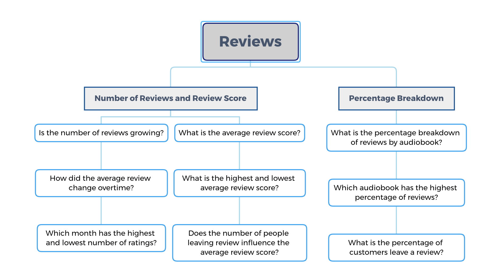
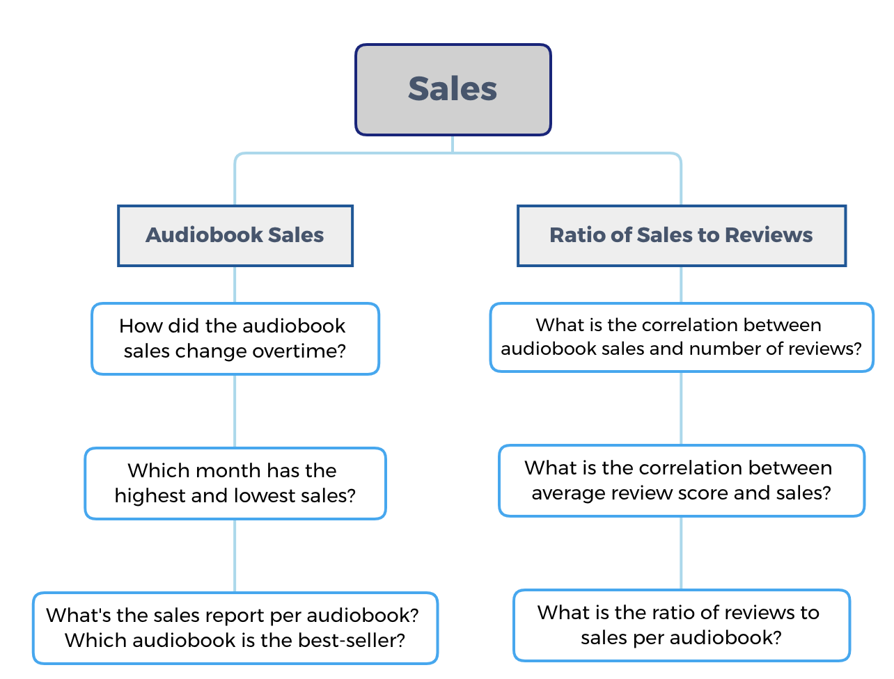

<style type="text/css">

.multi_figure {
    display: flex;
    justify-content: space-evenly;
    margin-bottom: .7rem;
}

@media (max-width: 1095px) {
  .multi_figure {
    display: flex;
    margin-bottom: .7rem;
    flex-direction: column;
  }

}

.tg {
    border-collapse:collapse;
    border-spacing:0;
}
 .tg td{
    border-color:black;
    border-style:solid;
    border-width:1px;
    font-family:Arial, sans-serif;
    font-size:14px;
     overflow:hidden;
    padding:10px 5px;
    word-break:normal;
}
 .tg th{
    border-color:black;
    border-style:solid;
    border-width:1px;
    font-family:Arial, sans-serif;
    font-size:14px;
     font-weight:normal;
    overflow:hidden;
    padding:10px 5px;
    word-break:normal;
}
 .tg .tg-0pky{
    border-color:inherit;
    text-align:left;
    vertical-align:top
}
</style>

## Dashboard
❗ *Please feel free to click to the following button at the bottom right of the dashboard to see it in fullscreen.*
<iframe src="https://public.tableau.com/views/RateofUKHospitalAdmissionsforMentalHealthDisordersAmongResidentsUnderAge18ProjectHealthViz/11AbouttheData?:language=fr&:display_count=y&mobile=&:toolbar=n&:origin=viz_share_link" allowfullscreen width="100%" height="600"></iframe>

## Context of the Project

### Data Source
Data was from a company that has produced several audio books and has been selling them in an online marketplace. Reviews is one of the components of this marketplace which I used to determine its correlation to Audiobook sales.

In this project, I have used two CSV files; one about sales and another one that contains information about reviews. I used MySQL Workbench to visualize their respective schema.

<div class="multi_figure">
    <table class="tg">
        <caption style="text-align:center">Sales table<caption>
        <thead>
        <tr>
            <th class="tg-0pky">Audiobook_name</th>
            <th class="tg-0pky">Date_of_Purchase</th>
            <th class="tg-0pky">Transaction_ID</th>
        </tr>
        </thead>
        <tbody>
        <tr>
            <td class="tg-0pky">Audiobook #4</td>
            <td class="tg-0pky">43134</td>
            <td class="tg-0pky">1100040</td>
        </tr>
        <tr>
            <td class="tg-0pky">Audiobook #6</td>
            <td class="tg-0pky">43135</td>
            <td class="tg-0pky">1078760</td>
        </tr>
        <tr>
            <td class="tg-0pky">Audiobook #1</td>
            <td class="tg-0pky">43135</td>
            <td class="tg-0pky">1078810</td>
        </tr>
        </tbody>
    </table>
    <table class="tg">
        <caption style="text-align:center">Review table<caption>
        <thead>
        <tr>
            <th class="tg-0pky">Audiobook_name</th>
            <th class="tg-0pky">review_date</th>
            <th class="tg-0pky">rating</th>
            <th class="tg-0pky">Transaction_ID</th>
        </tr>
        </thead>
        <tbody>
        <tr>
            <td class="tg-0pky">Audiobook #1</td>
            <td class="tg-0pky">2/7/18</td>
            <td class="tg-0pky">10</td>
            <td class="tg-0pky">4271210</td>
        </tr>
        <tr>
            <td class="tg-0pky">Audiobook #7</td>
            <td class="tg-0pky">2/7/18</td>
            <td class="tg-0pky">10</td>
            <td class="tg-0pky">4360030</td>
        </tr>
        <tr>
            <td class="tg-0pky">Audiobook #1</td>
            <td class="tg-0pky">2/7/18</td>
            <td class="tg-0pky">7</td>
            <td class="tg-0pky">4532810</td>
        </tr>
        </tbody>
    </table>
</div>

Since the "date_of_purchase" column shows a vector number 5-digit number, I converted it into date format using the code below to be more comprehensible. 

``` sql
SELECT 
    Date_of_Purchase, 
    Audiobook_name, 
    Transaction_ID,
    DATE('1899-12-30') + INTERVAL Date_of_Purchase DAY AS readable_date
FROM Audiobook.sales
-- Only keep the rows whose the 5-digits date is valid
WHERE Date_of_Purchase REGEXP '^[0-9]{5}$'
```

<table class="tg" style="margin-left: auto; margin-right: auto;">
    <caption style="text-align:center">Sales table after processing</caption>
    <thead>
    <tr>
        <th class="tg-0pky">Audiobook_name</th>
        <th class="tg-0pky">Date_of_Purchase</th>
        <th class="tg-0pky">Transaction_ID</th>
        <th class="tg-0pky">readable_date</th>
    </tr>
    </thead>
    <tbody>
    <tr>
        <td class="tg-0pky">Audiobook #6</td>
        <td class="tg-0pky">43139</td>
        <td class="tg-0pky">1000160</td>
        <td class="tg-0pky">2018-02-08</td>
    </tr>
    <tr>
        <td class="tg-0pky">Audiobook #3</td>
        <td class="tg-0pky">43139</td>
        <td class="tg-0pky">1000230</td>
        <td class="tg-0pky">2018-02-08</td>
    </tr>
    <tr>
        <td class="tg-0pky">Audiobook #1</td>
        <td class="tg-0pky">43139</td>
        <td class="tg-0pky">1000310</td>
        <td class="tg-0pky">2018-02-08</td>
    </tr>
    </tbody>
</table>


### Dashboard
Using Tableau, I created a dashboard that would allow the management team to learn if the number of reviews the company receives has been growing.  This also gives an at a glance snapshot of how the average review scores change overtime, the percentage breakdown of the type of reviews, and the percentage of people acquiring an audio who left a review.

### Business Insights
The dashboard provides insights about the reviews and sales business questions a business person could have.
Those potential questions are listed in the two mindmap diagrams bellow

<figure>
    
    <figcaption style="text-align: center;">Fig.1 - Business questins about the reviews data</figcaption>
</figure>

<figure>
    
    <figcaption style="text-align: center;">Fig.1 - Business questins about the reviews data</figcaption>
</figure>

