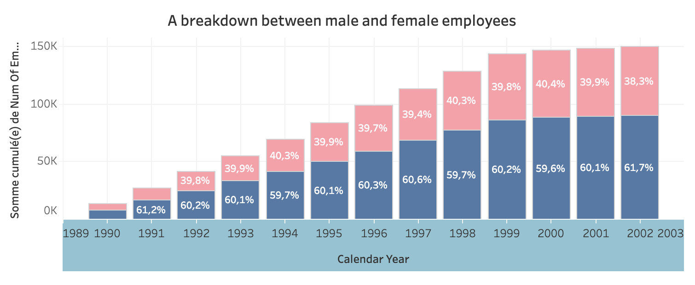
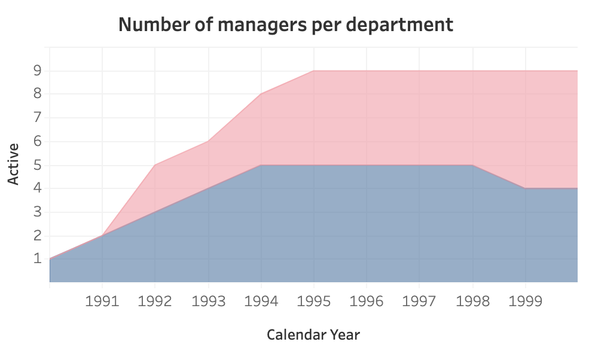

##Dashboard

This dashboard creates a visualization that provides a breakdown between male and female employees working in the company for each year from 1990 as well as their annual average salary. The comparison between the number of male and female managers from different departments per year is also shown in this dashboard.

❗ **Please feel free to click the fullscreen button at the bottom right of the dashboard to see it in fullscreen.**
<iframe src="https://public.tableau.com/views/Employees_16162571419100/Dashboard1?:showVizHome=no&:embed=true" width="850" height="600" allowfullscreen="true"></iframe> 

### Breakdown between Male and Female employees in the company each year, since 1990
With the following SQL code we can compute the breakdown of male and female since 1990
```sql
#Problem 1: Breakdown between Male and Female employees in the company each year, since 1990
SELECT  
	YEAR(d.from_date) AS calendar_year,
    ee.gender,
    COUNT(ee.emp_no) AS num_of_employees
FROM
	t_employees ee
JOIN 
	t_dept_emp d ON d.emp_no = ee.emp_no
GROUP BY calendar_year, ee.gender
HAVING calendar_year >= 1990
ORDER BY YEAR(d.from_date);
```



Without big suprise, women have been present more and more in the industry (all fields put together) since the 1990.

### Compare the number of Male to Female managers from the different departments for each year starting 1990
Another interesting visualization is the number of male/female manager per department. The following SQL code compute just that.
```sql
#Problem 2: Compare the number of Male to Female managers from the different departments for each year starting 1990
SELECT  d.dept_name,
		ee.gender,
        dm.emp_no,
        dm.from_date,
        dm.to_date,
        e.calendar_year,
CASE 
	WHEN YEAR(dm.to_date) >= e.calendar_year  AND YEAR(dm.from_date) <= e.calendar_year THEN 1
		ELSE 0
	END AS "active"	
FROM (
	SELECT YEAR(hire_date) AS calendar_year
	FROM t_employees
    GROUP BY calendar_year) e
		CROSS JOIN
	t_dept_manager dm
		JOIN
	t_departments d ON d.dept_no = dm.dept_no
		JOIN
	t_employees ee ON ee.emp_no = dm.emp_no
ORDER BY dm.emp_no, calendar_year;
```

Interestingly enough, development appears to be the only field were women have reached the same level of presence as men when it comes to management.

### Compare the average salary of female versus male employees in the entire company until year 2002
```sql
#Problem 3: Compare the average salary of female versus male employees in the entire company until year 2002
# add a filter allowing to show result per each department
SELECT 
	ee.gender,
    d.dept_name,
	ROUND(AVG(s.salary), 2) AS salary,
    YEAR(s.from_date) AS calendar_year
FROM  t_salaries s
	JOIN
 t_employees ee ON s.emp_no = ee.emp_no 
	JOIN
t_dept_emp de ON ee.emp_no= de.emp_no
	JOIN
t_departments d ON de.dept_no = d.dept_no
GROUP BY d.dept_no, ee.gender,calendar_year
HAVING calendar_year <= 2000
ORDER BY d.dept_no;
```

<!-- Furthermore, an SQL stored procedure was created to allow you to obtain the average male and female salary per department within a certain salary range (excluding those who earned less than $50,000  and not greater than  $90,000). 

-code problem 4-

Lastly, using the  filter allows you to see categorized results by department. -->

##Data

For this project, we used and modified a huge employee data set that was found on github. The database script has been re-organized in an SQL file that can be downloaded and run. Below is the code that creates the entire database from the first to the last piece. 

```sql
CREATE TABLE t_employees (
    emp_no      INT		        NOT NULL,
    birth_date  DATE            NOT NULL,
    first_name  VARCHAR(14)     NOT NULL,
    last_name   VARCHAR(16)     NOT NULL,
    gender      ENUM ('M','F')  NOT NULL,    
    hire_date   DATE            NOT NULL,
    PRIMARY KEY (emp_no)
);

CREATE TABLE t_departments (
    dept_no     CHAR(4)         NOT NULL,
    dept_name   VARCHAR(40)     NOT NULL,
    PRIMARY KEY (dept_no),
    UNIQUE  KEY (dept_name)
);

CREATE TABLE t_dept_manager (
   emp_no       INT             NOT NULL,
   dept_no      CHAR(4)         NOT NULL,
   from_date    DATE            NOT NULL,
   to_date      DATE            NOT NULL,
   PRIMARY KEY (emp_no,dept_no)
); 

CREATE TABLE t_dept_emp (
    emp_no      INT             NOT NULL,
    dept_no     CHAR(4)         NOT NULL,
    from_date   DATE            NOT NULL,
    to_date     DATE            NOT NULL,
    PRIMARY KEY (emp_no,dept_no)
);

CREATE TABLE t_salaries (
    emp_no      INT             NOT NULL,
    salary      INT             NOT NULL,
    from_date   DATE            NOT NULL,
    to_date     DATE            NOT NULL,
    PRIMARY KEY (emp_no, from_date)
);
```

<!-- Here are the following columns in the employee database with the respective schema. -->
